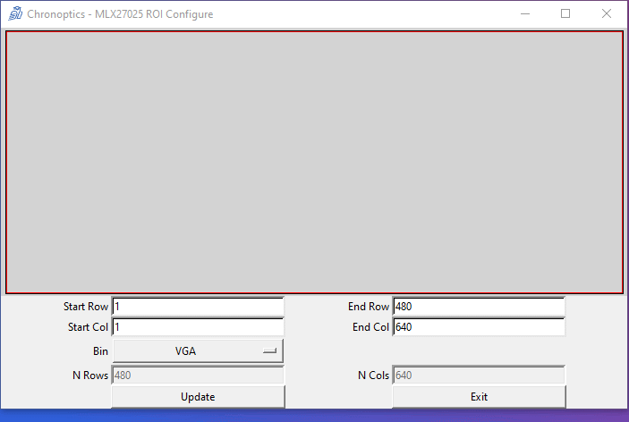
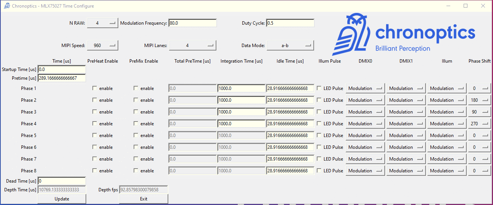

# Time-of-Flight Sensor Configuration

## Description

This Python utility is for calculating the register values of the [MLX75027](https://www.melexis.com/en/product/MLX75027/Automotive-VGA-Time-Of-Flight-Sensor) Time-of-Flight image sensor from Melexis, and for the [EPC660](https://www.espros.com/photonics/time-of-flight-chip-epc660/) Time-of-Flight image sensor from Espros Photonics.

There is a set of functions in the mlx75027_config folder for calculating register values and for importing and export csv files.  

A Tkinter GUI is provided for visually setting the values and generating configurations, this GUI is in the configTool folder.  

## Installation

Add the this folder (the one with the README.md in) to your PYTHONPATH variable. 

## Using 
To run the Tkinter GUI for the MLX75027 Sensor
    
    python MLX75027_RegisterMap.py 

The mlx75027.csv file contains the registers, and their names, and default values. 

To run the Tkinter GUI for the EPC660 Sensor 

    python EPC660_RegisterMap.py

The test cases can be run in the test folder 

    python MLX75027ConfigTest.py 

## Documentation 

The MLX75027 version of the datasheet v0.8 that this tool was written for is provided in the doc folder for reference, as the datasheet might be updated by Melexis. 

The MLX75027_RegisterMap.py opens a window as shown below 

The fields are
* Register : This is the register name, and as often as possible it is the same register name in the MLX75027 datasheet
* Bits : The bits of the register that are used
* Description : What the register actually does 
* Values : The value of the register as an integer 

The buttons do the following
* Export CSV : Exports the current registers, bits, descriptions and values to a CSV file
* Export Registers : Exports the registers addresses and their values 
* Import CSV : Load a CSV which has previously been exported. 
* ROI : Opens another window to configure the region of interest (ROI) 
* Time : Opens another window to configure the depth frame timing 
* Quit : Exits 

The ROI GUI Window is shown in the below animation, the region of interest and binning can be configured.  

The Time GUI Window is shown in the below animation. 

Here the number of raw frames (phases) can be configured, the modulation frequency, MIPI speed, data type, etc. The integration time of each raw frame can be configured along with any dead frame time. This allow for configuration of each raw frame, it's integration time, and what datatype is exported. 

## Contact 

For comment, assistance or bug reporting (or the correct interpretation of the datasheet) please contact Refael Whyte, r.whyte@chronoptics.com 

[Chronoptics](https://www.chronoptics.com) designs and develops 3D time-of-flight depth sensing cameras, contact us for any of your 3D ToF needs. 

## Features yet to support
List of features not yet supported

MLX75027
* If selecting Flip or Mirror the ROI needs to be reversed 
* Set the PN9 test pattern
* Output the boot sequence registers 

EPC660 
* Binning in HDR or Dual Phase mode, the row and column calculation is currently not supported in these sensor modes. 
